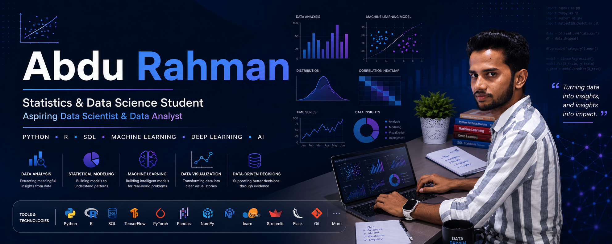

<!-- ========================= -->
<!-- Banner -->
<!-- ========================= -->

  

<h1 align="center">Hi 👋, I'm Abdu Rahman</h1>

  <strong>Statistics & Data Science Student</strong> 
  Aspiring Data Scientist & Data Analyst

  Python • R • SQL • Machine Learning • Deep Learning • AI

---

## 🚀 About Me

🎓 I am a fourth-year **Bachelor of Statistics and Data Science** student at **Parami University – Bard College**.

📊 I am passionate about using data to uncover insights, solve problems, and support data-driven decision making.

🔍 My interests include:

- Data Analysis & Visualization
- Statistical Modeling
- Machine Learning
- Deep Learning
- Artificial Intelligence
- Business Analytics

💡 I have hands-on experience building and evaluating machine learning and deep learning models, including:

- Regression & Classification Models
- Convolutional Neural Networks (CNNs)
- Transfer Learning
- Predictive Analytics Projects

🌱 Currently exploring advanced machine learning techniques, AI applications, and real-world data science projects.

---

## 🌐 Connect with Me

---

## 💻 Languages

### Database Technologies

- SQL
- PostgreSQL
- MySQL

---

## 🛠️ Tools & Frameworks

### Data Science & Analytics

- Pandas
- NumPy
- Matplotlib
- Seaborn
- Scikit-learn
- Statsmodels

### Machine Learning & Deep Learning

- TensorFlow
- PyTorch
- CNNs
- Transfer Learning

### App Development & Deployment

- Streamlit
- Flask

### Version Control

- Git
- GitHub

---

## 📌 Current Projects

🔹 Building end-to-end data analytics projects using Python, SQL, and visualization tools.

🔹 Developing machine learning models for predictive analytics and classification tasks.

🔹 Exploring deep learning architectures and transfer learning techniques.

🔹 Creating interactive data applications with Streamlit.

---

## 🎯 Current Focus

- Data Analytics
- Statistical Learning
- Machine Learning Engineering
- Deep Learning
- Artificial Intelligence
- Data Storytelling & Visualization

---

## 📊 GitHub Stats

---

## 🔥 Top Languages

  

---

## 📈 Activity Graph

  

---

## 🐍 Contribution Snake

  

---

  <i>"Turning data into meaningful insights through statistics, analytics, and machine learning."</i>

